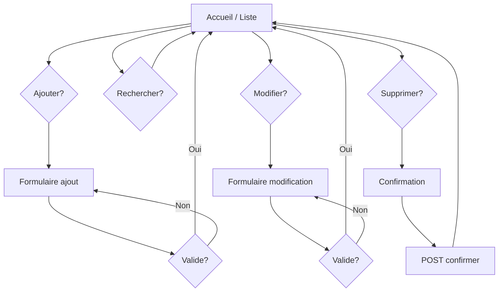

# Documentation du code — Gestion des Clients

Ce document explique l'architecture et le rôle de chaque partie du code de l'application.

---

## 1. Architecture globale

L'application suit le pattern **MVT** (Model - View - Template) de Django :

```
Requête HTTP → urls.py → views.py → (models.py / forms.py) → templates HTML
```

| Composant | Fichier / dossier | Rôle |
|-----------|-------------------|------|
| Projet | `gestion_clients/` | Configuration globale (settings, URLs racine) |
| Application | `clients/` | Logique métier : clients CRUD |
| Templates | `clients/templates/clients/` | Pages HTML |
| Styles | `static/css/style.css` | Apparence de l'interface |
| Base de données | `db.sqlite3` | Stockage des clients (créé après `migrate`) |

---

## 2. Modèle de données — `clients/models.py`

Le modèle `Client` représente un client en base de données.

| Champ | Type | Description |
|-------|------|-------------|
| `nom` | CharField | Nom du client (max 100 caractères) |
| `email` | EmailField | Adresse email |
| `telephone` | CharField | Numéro de téléphone |
| `adresse` | CharField | Adresse postale |
| `date_creation` | DateTimeField | Date d'enregistrement (remplie automatiquement) |

- `Meta.ordering = ["nom"]` : tri par défaut par nom.
- `__str__` : affiche le nom dans l'admin et le shell.

Django génère automatiquement une clé primaire `id` pour chaque enregistrement.

---

## 3. Formulaire et validation — `clients/forms.py`

`ClientForm` est un **ModelForm** : il lie les champs HTML au modèle `Client`.

### Validation des champs vides

Chaque méthode `clean_<champ>()` :

1. Récupère la valeur du champ (`cleaned_data`)
2. Applique `.strip()` pour enlever les espaces
3. Lève `ValidationError` si la valeur est vide

Cela répond à l'exigence : *« Vérifier que les champs du formulaire ne sont pas vides avant l'ajout »* (et aussi à la modification).

### Widgets

Les attributs `class="form-control"` et `placeholder` permettent un style cohérent dans les templates.

---

## 4. Vues — `clients/views.py`

Quatre vues fonction-based gèrent toutes les actions.

### `liste_clients`

- Lit le paramètre GET `q` pour la **recherche par nom**
- Filtre avec `nom__icontains` (insensible à la casse)
- Passe `clients` et `recherche` au template

### `ajouter_client`

- **GET** : affiche un formulaire vide
- **POST** : valide le formulaire ; si valide → `save()` → message de succès → redirection vers la liste

### `modifier_client`

- Récupère le client par `pk` (identifiant) avec `get_object_or_404`
- Réutilise le même template que l'ajout avec `instance=client` pour préremplir les champs

### `supprimer_client`

- **GET** : page de confirmation
- **POST** : suppression réelle + message de succès

### Messages de confirmation

`django.contrib.messages` stocke des messages flash en session :

```python
messages.success(request, "Client ajouté avec succès.")
```

Le template `base.html` les affiche en haut de chaque page.

---

## 5. Routage des URLs

### Projet — `gestion_clients/urls.py`

```python
path('', include('clients.urls')),
```

Toutes les URLs de l'app commencent à la racine du site.

### Application — `clients/urls.py`

| Nom URL | Vue | Chemin |
|---------|-----|--------|
| `liste_clients` | `liste_clients` | `""` |
| `ajouter_client` | `ajouter_client` | `"ajouter/"` |
| `modifier_client` | `modifier_client` | `"<int:pk>/modifier/"` |
| `supprimer_client` | `supprimer_client` | `"<int:pk>/supprimer/"` |

Les templates utilisent `` pour la **navigation** entre pages.

---

## 6. Configuration — `gestion_clients/settings.py`

Points importants :

- `'clients'` dans `INSTALLED_APPS` : active l'application
- `LANGUAGE_CODE = 'fr-fr'` et `TIME_ZONE = 'Europe/Paris'` : contexte français
- `STATICFILES_DIRS` : sert les fichiers CSS du dossier `static/`
- Middleware `MessageMiddleware` : nécessaire pour les messages de confirmation

---

## 7. Templates

### `base.html`

- En-tête avec **navigation** (liste + ajouter)
- Bloc `` pour le contenu des pages enfants
- Affichage des **messages** Django
- Lien vers la feuille de style

### `liste.html`

- **Tableau** des clients (colonnes : nom, email, téléphone, adresse, actions)
- Formulaire de **recherche** (méthode GET, paramètre `q`)
- Boutons Modifier / Supprimer par ligne

### `formulaire.html`

- Utilisé pour **ajout** et **modification**
- Boucle `` + affichage des erreurs de validation
- Token **CSRF** : `` (protection obligatoire en POST)

### `confirmer_suppression.html`

- Évite les suppressions accidentelles (confirmation en deux étapes)

---

## 8. Interface d'administration — `clients/admin.py`

Enregistre le modèle `Client` dans l'admin Django avec :

- Colonnes visibles dans la liste
- Recherche par nom et email

Utile pour le débogage ou la gestion avancée, en complément de l'interface web custom.

---

## 9. Flux utilisateur (schéma)



---

## 10. Correspondance avec le cahier des charges

| Exigence | Implémentation |
|----------|----------------|
| Ajouter un client via formulaire | `ajouter_client` + `formulaire.html` |
| Enregistrer en base de données | `ClientForm.save()` → modèle `Client` |
| Liste en tableau | `liste.html` |
| Supprimer un client | `supprimer_client` + confirmation |
| Champs non vides | `clean_*` dans `forms.py` |
| Navigation entre pages | `base.html` + liens `` |
| Message après ajout/suppression | `messages.success` |
| Interface simple et claire | `static/css/style.css` |
| Modifier un client | `modifier_client` |
| Recherche par nom | `liste_clients` + filtre `nom__icontains` |

---

## 11. Fichiers à ne pas modifier sans raison

| Fichier | Note |
|---------|------|
| `manage.py` | Point d'entrée Django — généré automatiquement |
| `gestion_clients/wsgi.py` | Déploiement serveur production |
| `clients/migrations/` | Généré par `makemigrations` — ne pas éditer à la main |

---

## 12. Extension possible

- Pagination de la liste si beaucoup de clients
- Validation avancée du téléphone (regex)
- Authentification utilisateur (`LoginRequiredMixin`)
- Tests automatisés dans `clients/tests.py`
